[](https://github.com/sagnikgh1899/data-512-homework_1/blob/main/LICENSE)
# DATA 512: Human Centered Data Science (Autumn 2023)
## The Impact of Wildfires on Tulare County

## Goal
This project aims to examine the impact of wildfire smoke on Tulare County during a specific timeframe and focusing on several research questions pivotal for the county's social and economic well-being. These questions include:
1. What are the estimated smoke impacts on Tulare city for the last 60 years?
2. To what extent do certain respiratory diseases linked to smoke-related pollution (e.g., Chronic respiratory diseases, Chronic obstructive pulmonary disease, Asthma) exhibit higher mortality rates compared to diseases not directly related to smoke-related pollution (e.g., Pneumoconiosis, Coal workers pneumoconiosis) in Tulare County from 1980 to 2014?
3. How does fire smoke relate to the age-standardized mortality rate for respiratory diseases in Tulare County across different years?
3. Is there a noticeable difference in respiratory disease mortality rates between sexes due to variations in exposure to fire smoke in Tulare County?
4. How does the prevalence of smoke fires in Tulare County connect with rates of asthma-related hospitalizations across different age groups over time?


## Motivation
The escalating frequency of summer wildfires in the western US, particularly in areas like Tulare County, CA, has spurred a critical need for comprehensive analysis and proactive measures. These wildfires, attributed to various factors such as climate change and forestry policies, have unleashed substantial smoke, adversely affecting health, tourism, property, and overall societal facets. The urgency lies in predictive health planning, which utilizes forecasts of smoke-related respiratory health trends to enact preemptive mitigation strategies. Moreover, understanding the impact of smoke on Tulare County serves as a pivotal informant for policy decisions, aiding in city planning and allocation of healthcare resources. Rising hospitalizations and mortality rates underscore the necessity for proactive measures and heightened awareness within the community. By translating extensive data into actionable policies, there's a safeguarding of the community against the respiratory risks induced by smoke. This analysis not only serves the people of Tulare County but also becomes instrumental in guiding government officials and civic institutions toward human-centered social and economic reforms. The data-driven insights and visualizations wield a significant influence, drawing the attention of policymakers, city managers, and civic institutions, facilitating informed planning to mitigate future impacts from wildfires and safeguard the lives of Tulare County residents.


## Repository tree
```
.
├── data/
│   └── Wildland_Fire_Polygon_Metadata.xml
├── images/
│   ├── Age_Standardized_Mortality_Rate_From_Asthma_For_Both_Sexes_With_Notable_Events_in_Tulare_County.png
│   ├── Annual_Acres_Burned_in_Proximity_to_Tulare.png
│   ├── Fire_Distribution_by_Distance_from_Tulare.png
│   ├── Fire_Smoke_Estimate_vs_AQI_in_Tulare.png
│   ├── Mean_Asthma_Mortality_by_Sex.png
│   ├── Mean_Number_of_Hospitalizations_For_Asthma_across_Specific_Age_Groups.png
│   ├── Relationship_between_Fire_Smoke_Estimate_Age_Standardized_Mortality_Rate_From_Asthma_Male.png
│   ├── Relationship_between_Fire_Smoke_Estimate_and_Age_Standardized_Mortality_Rate_From_Asthma.png
│   ├── Relationship_between_Fire_Smoke_Estimate_and_Age_Standardized_Mortality_Rate_From_COPD.png
│   ├── Relationship_between_Fire_Smoke_Estimate_and_Age_Standardized_Rate_From_Asthma_Female.png
│   ├── Year_vs_Smoke_Estimate_and_Year_vs_Number_of_Hospitalizations.png
│   └── smoke_vs_non_smoke_related_disease_comparison_plot.png
├── intermediate data/
│   ├── annual_smoke_estimate.csv
│   ├── final_aqi_each_year.csv
│   ├── gaseous_aqi_data_processed.csv
│   ├── gaseous_data.json
│   ├── particulate_aqi_data_processed.csv
│   ├── particulate_data.json
│   ├── resp_disease_both_asthma.csv
│   ├── resp_disease_both_copd.csv
│   ├── resp_disease_female_asthma.csv
│   ├── resp_disease_female_copd.csv
│   ├── resp_disease_male_asthma.csv
│   └── resp_disease_male_copd.csv
├── reports/
│   ├── Data 512 Project Part 2 - Extension Plan.pdf
│   ├── Final Report.pdf
│   ├── Sagnik Ghosal_PechaKucha Presentation.pptx
│   └── Visualization Descriptions and Reflection.pdf
├── src/
│   ├── Analysis_Prediction_And_Visualization.ipynb
│   ├── Compare_Smoke_Estimate_With_AQI.ipynb
│   ├── Data_Acquisition.ipynb
│   ├── Extension Plan Analysis.ipynb
│   ├── Extension Plan.ipynb
│   └── Get_AQI_Per_Year.ipynb
├── LICENSE
└── README.md
```

### Description
- **data** : This directory contains data files, including metadata about the wildland fire polygons.
- **images** : Here, we'll find different visualizations that will help us answer the research questions.
- **intermediate data** : This directory stores intermediate data files used in the analysis, including processed data related to smoke estimates, AQI data, and more.
- **reports** : This directory contains reports in PDF format and the PechaKucha presentation which have been created over the course of this project and provides interesting descriptions and reflections on the project's outcomes.
- **src** : The source code for the project is located here. It includes Jupyter Notebook files that cover various aspects of the analysis, prediction, data acquisition, AQI per year, and extension plan comprising research questions and their answers.
- **LICENSE** : A file that contains an MIT LICENSE for sagnikgh1899/data-512-Wildfires_Impact_on_Tulare_County repo.
- **README.md** : A file that contains information to reproduce the analysis, including data descriptions, attributions and provenance information, and descriptions of all relevant resources and documentation (inside and outside the repo) and hyperlinks to those resources.

### Library installation required
 - pyproj
 - geojson
 - tqdm
 - seaborn
 - matplotlib
 - statsmodels
 - requests
 - scipy
 - numpy
 - pandas


## Data Sources & Descriptions

### Input Data
The following are the input data descriptions and their sources:
1. **USGS Wildland Fire Combined Dataset**: This dataset is in JSON format. The common analysis research question is based on one specific dataset which can be found at [Combined wildland fire datasets for the United States and certain territories, 1800s-Present (combined wildland fire polygons)](https://www.sciencebase.gov/catalog/item/61aa537dd34eb622f699df81). This dataset was collected and aggregated by the US Geological Survey. The dataset is relatively well documented. Fire polygons are available in ArcGIS and GeoJSON formats. We have been assigned one US city that will form the basis for our individual analysis. We can find our individual US city assignment from [this Google spreadsheet](https://docs.google.com/spreadsheets/d/1cmTW5fgU3KyH6JbrRao-qWjzu2GovKk_BkA7a-poGFw/edit?usp=drive_link). The table below provides detailed descriptions of the data fields in this dataset.

| NAME | DTYPE | DESCRIPTION |
| ----------- | ----------- | ----------- |
| OBJECTID | Integer | Unique identification for the polygon and it's attributes |
| USGS_Assigned_ID | Integer | Assigned unique identification for the polygon and it's attributes. Used to provide consistency if parts of the dataset are exported or the OBJECTID is otherwise changed |
| Assigned_Fire_Type | String | Based on the fire polygon(s) used to create this fire feature what is the type assigned to this fire? If more than one type was assigned to a combined polygon, the assigned fire type was assigned in the following order of dominance: Wildfire, Likely Wildfire, Unknown - Likely Wildfire, Prescribed Fire, Unknown - Likely Prescribed Fire |
| Fire_Year | Integer | The calendar year when the dataset creators determined the fire occurred |
| Fire_Polygon_Tier | Integer | The tier from which the fire polygon was generated. One or more polygons within the tier could be combined to create the fire polygon |
| Fire_Attribute_Tiers | String | All fire tiers that contributed attributes to the fire feature. A list of all tiers where a polygon intersects the current fire perimeter in space and time |
| GIS_Acres | Float | The GIS calculated acres of the fire polygon calculated by using the Calculate Geometry tool in ArcGIS Pro |
| GIS_Hectares | Float | The GIS calculated hectares of the fire polygon calculated by using the Calculate Geometry tool in ArcGIS Pro |
| Source_Datasets | String | All of the original source datasets that contributed to either the polygon or the attributes. Each dataset has the number of polygons contributed listed in parentheses after the dataset name |
| Listed_Fire_Types | String | Each fire type listed in the fires from the merged dataset that intersect this polygon in space and year. The number of features that contributed the specific fire type are in parentheses after the fire type |
| Listed_Fire_Names | String | Each fire name listed in the fires from the merged dataset that intersect this polygon in space and year. The number of features that contributed the specific fire name are in parentheses after the fire name |
| Listed_Fire_Codes | String | Each fire code listed in the fires from the merged dataset that intersect this polygon in space and year. The number of features that contributed the specific fire code are in parentheses after the fire code |
| Listed_Fire_IDs | String | Each fire type listed in the IDs from the merged dataset that intersect this polygon in space and year. The number of features that contributed the specific fire ID are in parentheses after the fire ID |
| Listed_Fire_IRWIN_IDs | String | Each fire IRWIN ID listed in the fires from the merged dataset that intersect this polygon in space and year. The number of features that contributed the specific fire IRWIN ID are in parentheses after the fire IRWIN ID |
| Listed_Fire_Dates | String | Each fire date listed in the fires from the merged dataset that intersect this polygon in space and year. The number of features that contributed the specific fire date are in parentheses after the fire date |
| Listed_Fire_Causes | String | Each fire cause listed in the fires from the merged dataset that intersect this polygon in space and year. The number of features that contributed the specific fire cause are in parentheses after the fire cause |
| Listed_Fire_Cause_Class | String | Each fire cause class listed in the fires from the merged dataset that intersect this polygon in space and year. The number of features that contributed the specific fire cause class are in parentheses after the fire cause class |
| Listed_Rx_Reported_Acres | String | Each prescribed fire reported acres listed in the fires from the merged dataset that intersect this polygon in space and year. The number of features that contributed the specific reported acres are in parentheses after the reported acres |
| Listed_Map_Digitize_Methods | String | Each fire digitization method listed in the fires from the merged dataset that intersect this polygon in space and year. The number of features that contributed the specific fire digitization method are in parentheses after the fire digitization method |
| Listed_Notes | String | Each fire notes listed in the fires from the merged dataset that intersect this polygon in space and year. The number of features that contributed the specific fire notes are in parentheses after the fire note |
| Processing_Notes | String | Indicates that the attribute data were altered during the processing and a new attribute was indicated. It will also explain the rationale for the change. Each polygon that had an attribute changed will be listed along with a count, in parentheses indicating how many polygons had the change made to them |
| Wildfire_Notice | String | A notice present in every field that indicates the quality of the wildfire data in this dataset |
| Prescribed_Burn_Notice | String | A notice present in every field that indicates the quality of the prescribed burn data in this dataset |
| Wildfire_and_Rx_Flag | String | A text flag field indicating that the attributes from the various sources indicate that the fire was both a wildfire and a prescribed fire. This could indicate an error in assigning the fire type, a misassignment of the fire type, or that there were actually two fires that occurred in this area in the same year, one a wildfire and one a prescribed burn |
| Overlap_Within_1_or_2_Flag | String | An ArcGIS Tabulate Intersection Tool was used to identify areas that burned with >10% overlap of the current fire within 1 or 2 years of the current burn. Each fire that met that criteria was included in this attribute including it's ID, year burned, percent overlap, and acres |
| Circleness_Scale | Float | A measure of a polygon's similarity to a true circle. calculated using the Shape_Length and Shape_Area fields. Circle-ness = 4*pi*(Shape_Area/(Shape_Length * Shape_Length)). As the number approaches 1, the polygon becomes more circular |
| Circle_Flag | String | Any Circle circle-ness values >=0.98 are flagged with a 1. The remaining values are null. 1 indicates that the polygon is very circle-like and is likely incorrect. However, other values that are not flagged may still be quite circular and incorrect |
| Exclude_From_Summary_Rasters | String | Some fires in this dataset appear to be buffered circles. These were kept in the dataset to show location and approximate area. However a decision was made to exclude circular fires larger than 1 acre in size from the summary raster calculations. This field indicates whether the fire was excluded from ('Yes') or included in ('No') the summary raster calculations |
| Shape_Length | Float | Automatically calculated perimeter length in meters |
| Shape_Area | Float | Automatically calculated polygon area in square meters |


2. **Mortalities from 1980 to 2014 from Respiratory Diseases in California Counties**: This dataset is in CSV format and can be downloaded from [the Institute for Health Metrics and Evaluation (IHME) website](https://ghdx.healthdata.org/record/ihme-data/united-states-chronic-respiratory-disease-mortality-rates-county-1980-2014). The dataset is maintained and hosted by IHME. It provides us the mortalities from 1980 to 2014 from Respiratory Diseases in all California Counties. This dataset comprehensively records data on causes, years, sexes, posterior mean estimates, 2.5th percentile estimates, and 97.5th percentile estimates. It delineates the age-standardized mortality rate (deaths per 100,000 population) across different sexes and for both sexes combined, spanning the years 1980-2014 for all counties within California. Focused on Tulare County, the dataset underwent filtering using FIPS=6107, resulting in 1050 entries across 16 columns. The dataset includes both string-based descriptors (measure_name, location_name, cause_name, sex, age_name, metric) and integer-based identifiers (measure_id, location_id, FIPS, cause_id, sex_id, age_id, year_id, mx, lower, upper). It's worth noting that the dataset stands clean, devoid of any null values across all columns. The table below provides detailed descriptions of the 16 columns.

| NAME | DTYPE | DESCRIPTION |
| ----------- | ----------- | ----------- |
| measure_id | Integer | Unique numeric identifier for the measure generated |
| measure_name | String | The measure (indicator) of the estimate |
| location_id | Integer | Unique numeric identifier for the location generated |
| location_name | String | Location of the estimate |
| FIPS | Integer | The Federal Information Processing Standards (FIPS) code, a unique identifier for states and counties in the United States |
| cause_id | Integer | Unique numeric identifier for the cause of disease or injury generated |
| cause_name | String | Cause of disease or injury of the estimate |
| sex_id | Integer | Unique numeric identifier for the sex generated |
| sex | String | Gender for the estimate |
| age_id | Integer | Unique numeric identifier for the age group generated |
| age_name | String | Age group estimated |
| year_id | Integer | Time period of estimate |
| metric | String | Metric/unit of measure for the estimate |
| mx | Float | Posterior mean estimate |
| lower | Float | 2.5% percentile estimate |
| upper | Float | 97.5% percentile estimate |

3. **Asthma Hospitalization Rates For California Counties from 2015 to 2020**: This dataset is also in CSV format and can be downloaded from [the California Health and Human Services Open Data Portal (CalHHS) website](https://data.chhs.ca.gov/dataset/asthma-hospitalization-rates-by-county). The dataset is maintained and hosted by CalHHS. This comprehensive dataset encompasses counts and rates (per 10,000 residents) of asthma-related hospitalizations across all counties in California. The dataset is organized by age groups (all ages, 0-17, 18-64, 65+) and racial/ethnic categories (white, black, Hispanic, Asian/Pacific Islander, and American Indian/Alaskan Native). Sourced from the Department of Health Care Access and Information Patient Discharge Data, the information is further refined by filtering exclusively for Tulare  County, resulting in 76 entries and 9 columns. The table below provides detailed descriptions of the 9 columns.

| NAME | DTYPE | DESCRIPTION |
| ----------- | ----------- | ----------- |
| _id | Integer | Unique numeric identifier for the specific entry |
| COUNTY | String | County of residence |
| YEAR | Integer | Year of hospitalization (discharge) |
| STRATA | String | General demographic category under which responses have been stratified |
| STRATA NAME | String | Specific demographic type under which responses have been stratified |
| AGE GROUP | String | All ages, 0-17 years, 18-64 years, and 65+ years |
| NUMBER OF HOSPITALIZATIONS | String | Number of hospitalizations for asthma. Events are counted per hospitalization and not per person |
| AGE-ADJUSTED HOSPITALIZATION RATE | Float | Calculated by dividing the number of asthma hospitalizations by the estimated population in that county and age group, age-adjusting to the 2000 U.S. Census, and multiplying by 10,000 |
| COMMENT | String | Any specific notes related to the particular entry |


### Intermediate Data Files
1. **resp_disease_both_copd.csv** - This dataset contains records of mortality attributed to Chronic Obstructive Pulmonary Disease (COPD). 

2. **resp_disease_both_asthma.csv** - This dataset contains records of mortality attributed to Asthma.

3. **resp_disease_female_copd.csv** - This dataset contains records of mortality attributed to Chronic Obstructive Pulmonary Disease (COPD) for females only. 

4. **resp_disease_male_asthma.csv** - This dataset contains records of mortality attributed to Asthma for males only. 

5. **resp_disease_female_asthma.csv** - This dataset contains records of mortality attributed to Asthma for females only. 

6. **resp_disease_male_copd.csv** - This dataset contains records of mortality attributed to Chronic Obstructive Pulmonary Disease (COPD) for males only.

**The intermediate files numbered 1-6 have the same schema which is outlined in the following table.**
| NAME | DTYPE | DESCRIPTION |
| ----------- | ----------- | ----------- |
| measure_name | String | Type of measure ("Deaths" in this case) |
| location_id | Integer | Location id for the particular entry (804 in this case) |
| location_name | String | Location name for the particular entry ("Tulare" in this case) |
| FIPS | Integer | FIPS code for the particular entry (6107 in this case) |
| cause_id | Integer | Cause id of the particular measure |
| cause_name | String | Cause name of the particular measure |
| sex_id | Integer | Denotes male (1) or female (2) or both (3) |
| sex | String | Denotes 'Male' or 'Female' or 'Both' |
| age_id | Integer | Age of the particular entry |
| age_name | String | Age name of the particular entry ("Age-standardized" in this case) |
| year_id | Integer | Year of the particular entry |
| metric | String | Metric used for the particular entry |
| mx | Float | 	Posterior mean estimate |

7. **annual_smoke_estimate.csv** - This dataset contains calculated fire smoke estimates. It comprises the following columns:

| NAME | DTYPE |
| ----------- | ----------- |
| Year | Integer | 
| Smoke_estimate | Float |
| Mean_GIS_Acres | Float |
| Mean_Distance | Float |

8. **final_aqi_each_year.csv** - This dataset contains the Annual Air Quality Index (AQI) data, organized by year. The dataset includes the following columns:

| NAME | DTYPE |
| ----------- | ----------- |
| Year | Integer |
| AQI | Float |

9. **gaseous_aqi_data_processed.csv** - This dataset contains Air Quality Index (AQI) data specifically focused on gaseous pollutants. The dataset encompasses the following columns:

| NAME | DTYPE |
| ----------- | ----------- |
| Date | Datetime |
| AQI | Integer |
| Sample_Duration | String |
| Pollutant_Type | Integer |

10. **particulate_aqi_data_processed.csv** - This dataset contains Air Quality Index (AQI) data specifically focused on particulate pollutants. The dataset encompasses the following columns:

| NAME | DTYPE |
| ----------- | ----------- |
| Date | Datetime |
| AQI | Integer |
| Sample_Duration | String |
| Pollutant_Type | Integer |

11. **gaseous_data.json** - This dataset contains Air Quality Index (AQI) data specifically focused on the same gaseous pollutants but in json format.

12. **particulate_data.json** - This dataset contains Air Quality Index (AQI) data specifically focused on the same particulate pollutants but in json format.


## Data & Notebook Licenses

### Data Licenses
1. **USGS Wildland Fire Combined Dataset** - [USGS Copyrights and Credits](https://www.usgs.gov/information-policies-and-instructions/copyrights-and-credits)
2. **IHME Mortalities from 1980 to 2014 from Respiratory Diseases in California Counties** - Data made available for download on IHME Websites can be used, shared, modified or built upon by non-commercial users in accordance with the [IHME FREE-OF-CHARGE NON-COMMERCIAL USER AGREEMENT](https://www.healthdata.org/about/ihme-free-charge-non-commercial-user-agreement).
3. **Asthma Hospitalization Rates For California Counties from 2015 to 2020** - Data available for download through the CalHHS Open Data Portal is open for utilization, sharing, modification, or expansion by non-commercial users, aligning with the 
[CalHHS Terms of Use](https://data.chhs.ca.gov/pages/terms).

### Notebook Licenses
1. The below sample codes were referenced for the following tasks and have been provided under the [Creative Commons](https://creativecommons.org/) [CC-BY license](https://creativecommons.org/licenses/by/4.0/):
    - [Sample notebook for Geodetic Distance Computation](https://drive.google.com/file/d/1qNI6hji8CvDeBsnLDAhJXvaqf2gcg8UV/view?usp=sharing)
    - [Sample code for accessing the US EPA Air Quality System API](https://drive.google.com/file/d/1bxl9qrb_52RocKNGfbZ5znHVqFDMkUzf/view?usp=sharing)
    - [Sample code for GeoJSON reader](https://drive.google.com/file/d/1TwCkvdaw0MxJzW7NSDg6XxYQ0dvaS44I/view?usp=sharing)


## Special Considerations
- Because of the large size of the "USGS_Wildland_Fire_Combined_Dataset.json" file it could not be uploaded on GitHub. Therefore to reproduce the results it is imperative to download the GeoJSON Files.zip from [this link](https://www.sciencebase.gov/catalog/item/61aa537dd34eb622f699df81) and extract the "USGS_Wildland_Fire_Combined_Dataset.json" file and place it under the data folder.
- The "all_fire_data_with_distance.csv" file is not present under the intermediate data folder because of its large size. However, if one follows the steps mentioned below to reproduce the analysis, it will be generated and no manual intervention is required.
- Fires have been filtered based on their distance from the city (maximum 1250 miles permissible) and the fire year (1963 to 2023 only)
- Since the fire date is quite messy, all fires for an year have been considered instead of just focusing on the fires between May 1st till October 31st.
- There are 35 instances of curveRings out of the 135061 instances, so we can choose to ignore them without much impact on the overall result.
- Based on the statistical outcomes and visual insights, we pursued the analysis solely focusing on Asthma, abandoning COPD due to its lack of meaningful results.


## Snapshot of Analysis Output

### 1. What are the estimated smoke impacts on Tulare city for the last 60 years?
#### Fire Distribution by Distance from Tulare
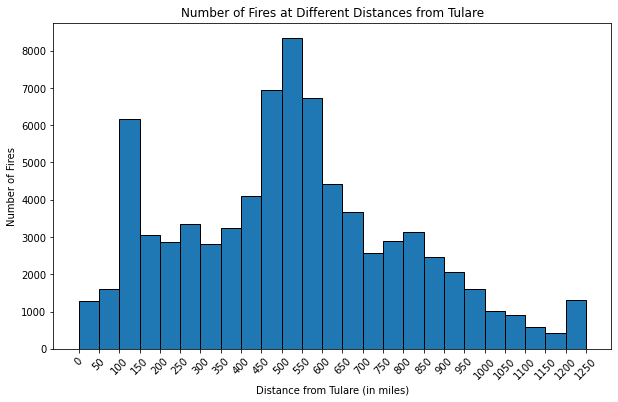 
#### Annual Acres Burned in Proximity to Tulare
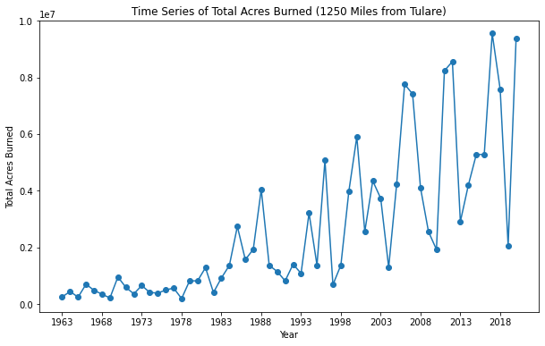
#### Fire Smoke Estimate vs AQI in Tulare
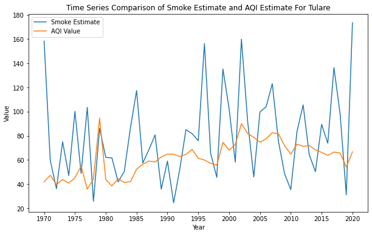

### 2. To what extent do certain respiratory diseases linked to smoke-related pollution (e.g., Chronic respiratory diseases, Chronic obstructive pulmonary disease, Asthma) exhibit higher mortality rates compared to diseases not directly related to smoke-related pollution (e.g., Pneumoconiosis, Coal workers pneumoconiosis) in Tulare County from 1980 to 2014?
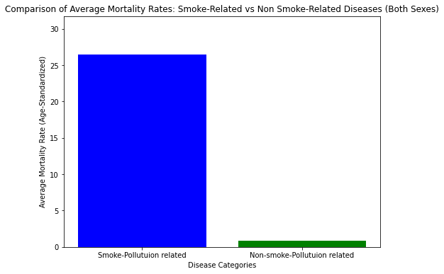


### 3. How does fire smoke relate to the age-standardized mortality rate for respiratory diseases in Tulare County across different years?


### 4. Is there a noticeable difference in respiratory disease mortality rates between sexes due to variations in exposure to fire smoke in Tulare County?
#### Male With Asthma
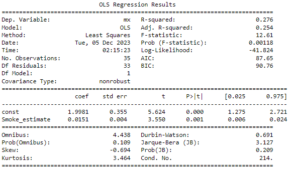

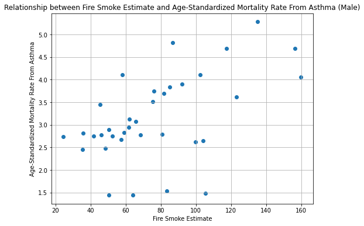

#### Female With Asthma
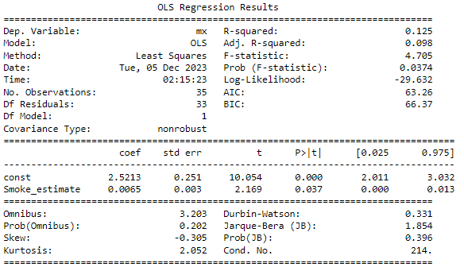

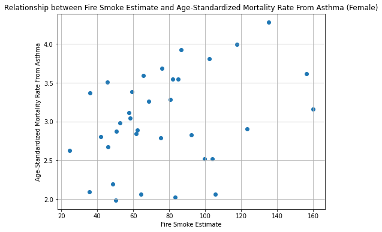

#### Age Standardized Mortality Rate From Asthma For Both Sexes With Notable Events in Tulare County
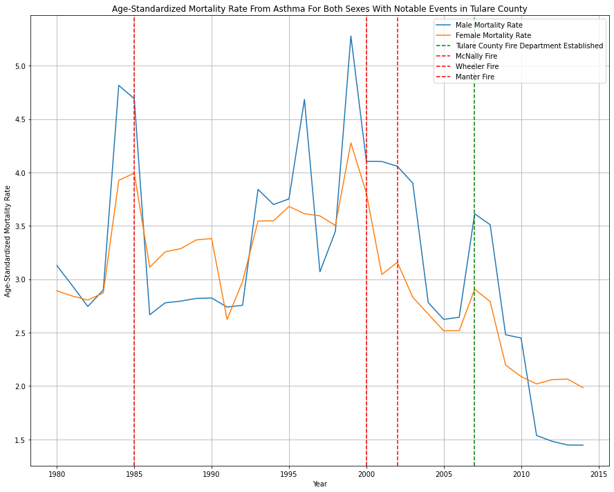

#### Mean Asthma Mortality by Sex
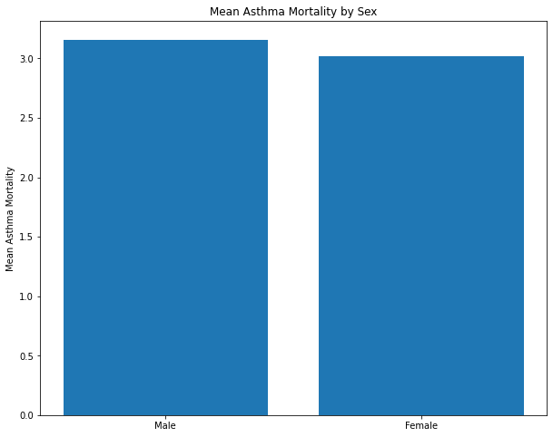


### 5. How does the prevalence of smoke fires in Tulare County connect with rates of asthma-related hospitalizations across different age groups over time?
#### Year vs Smoke Estimate and Year vs Number of Hospitalizations
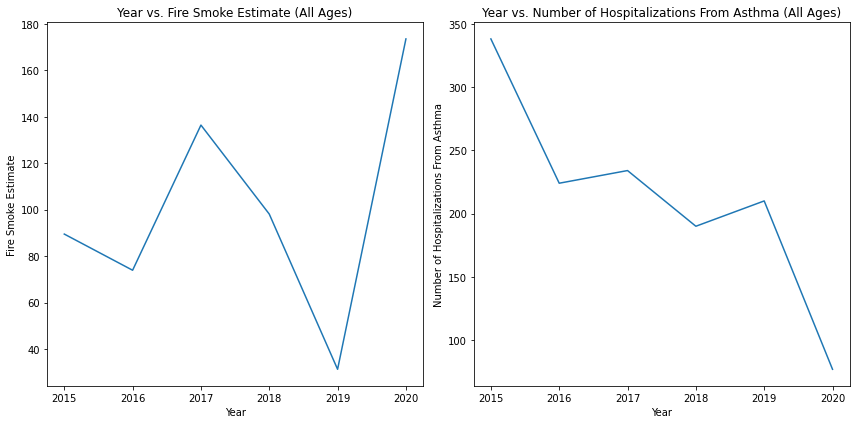

#### Mean Number of Hospitalizations For Asthma across Specific Age Groups
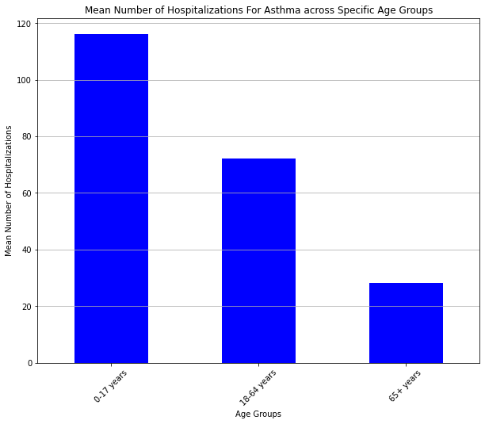


## Reproducing the analysis
To reproduce this analysis, follow these steps:
1. Clone this repository to your local machine.
2. Ensure you have Python installed with the required libraries.
3. Download the GeoJSON Files.zip from [this link](https://www.sciencebase.gov/catalog/item/61aa537dd34eb622f699df81) and extract the "USGS_Wildland_Fire_Combined_Dataset.json" file and place it under the data folder.
4. Run Data_Acquisition.ipynb to generate the dataset "all_fire_data_with_distance.csv" inside the 'intermediate data' folder that will be required for further analysis.
5. Next, run Analysis_Prediction_And_Visualization.ipynb to get the smoke estimate, build a prediction model and generate two of the visualizations.
6. Then, run Get_AQI_Per_Year.ipynb to generate the "final_aqi_each_year.csv" dataset.
7. Next, run the Compare_Smoke_Estimate_With_AQI.ipynb file to compare smoke estimate with obtained AQI and generate the third plot which along with the previous 2 plots will help answer the first research question.
8. For extended analysis, first download the two additional datasets from [this website](https://ghdx.healthdata.org/record/ihme-data/united-states-chronic-respiratory-disease-mortality-rates-county-1980-2014) and [this website](https://data.chhs.ca.gov/dataset/asthma-hospitalization-rates-by-county).
9. Run the Extension_Plan.ipynb file to get the required chunks of the bigger datasets for analysis.
10. Then, run the Extension_Plan_Analysis.ipynb file to look at the statistical analysis and visualizations based on which we answer the remaining 4 research questions.
11. Analyze the results.

*Feel free to use, modify, or contribute to this project while adhering to the MIT License.*


## Best practices for documentation
- PEP 8 – Style Guide for Python Code ([Reference link](https://peps.python.org/pep-0008/))
- Use of relative path addresses to help in reproducibility
- Use of intuitive variable and function names to ease in understanding
- Appropriate comments and documentation provided for the data aquisition, data processing and data analysis steps
- Description of all data files present in the repository mentioned

## Author
[Sagnik Ghosal](https://github.com/sagnikgh1899) 